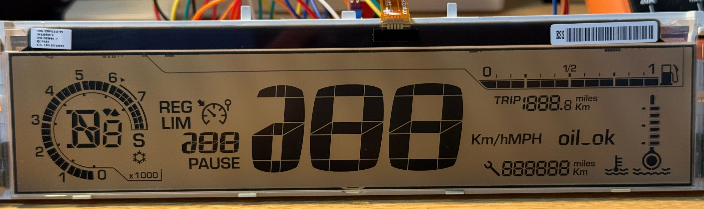
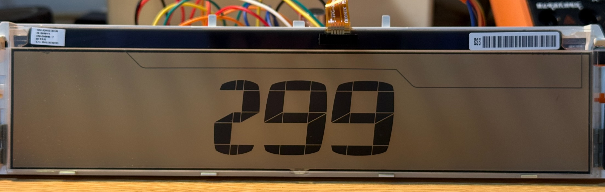
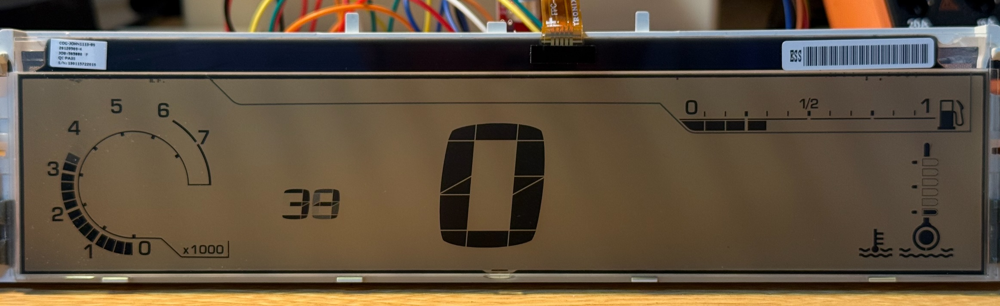
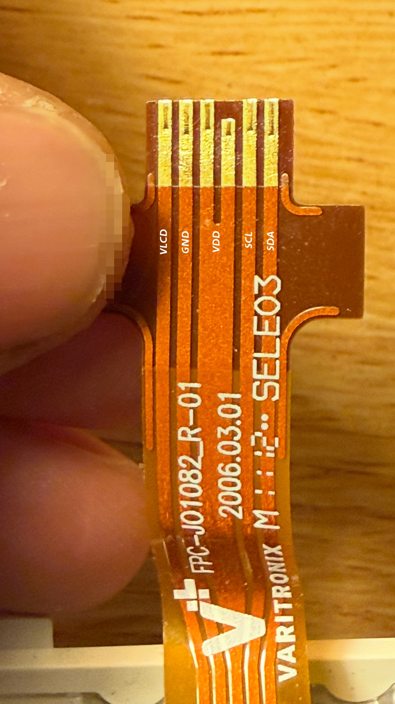

# PSA Automotive LCD I2C Driver

A reverse-engineered library and documentation for driving standard automotive segmented LCDs from the PSA Group (Peugeot/Citroën), specifically the central digital cluster used in models like the Citroën C4 (2004-2010), C-Triomphe, and potentially other similar vehicles using cascaded I2C LCD drivers (like PCF8576/PCF8566).

## Overview
These automotive LCDs feature a large central speed display, peripheral gauges (RPM, fuel, water temperature), and various status icons. Out of the factory, they are driven by the car's BSI/CAN bus via an intermediate board. However, the naked LCD panel itself can be driven directly over I2C by connecting to the internal ribbon cable. In our bench tests, the panel worked with **3.3V on VDD (ACC)** and **5V on V_LCD_PWR**.

This repository contains the full pinout, I2C protocol timing, memory mapping, and example code (for ESP32/Arduino) to bring these screens back to life for sim-racing, custom car gauges, or cyber-deck projects.

<p align="center">
  
</p>
<p align="center">
  
</p>
<p align="center">
  
</p>

## Hardware Requirements
- A 3.3V-capable ESP32 or any Arduino-compatible microcontroller.
- The naked automotive LCD panel (ribbon cable exposed).
- Optional: a boost converter for higher LCD drive voltage experiments.

### Pinout
Looking at the screen from the **front** (display side), the 5 pins on the ribbon cable from left to right (1 to 5) are:

| Pin # | Name | Description |
|---|---|---|
| **1** | **V_LCD_PWR** | LCD driving voltage. Use **5V** in the tested setup. |
| **2** | **GND** | Common Ground. |
| **3** | **VDD (ACC)** | Logic power for the internal IC and I2C pull-ups. Use **3.3V** in the tested setup. |
| **4** | **SCL** | I2C Clock. Use **100kHz** in the current examples. |
| **5** | **SDA** | I2C Data. |

<p align="center">
  
</p>

## Software Protocol

### I2C Timing & Configuration
The internal driver chips (likely cascaded PCF8576/PCF8566 variants) use a unified I2C address `0x38`. The panel memory is logically split into a Main Chip (`0xE0`) and a Sub Chip (`0xCE`). 
- **Bus Speed**: **100kHz** in the current examples and tested setup.
- **Multiplexing**: Must be hardcoded to `1:4 Mux, 1/3 Bias` (Command `0xC8`). Using other modes will cause severe ghosting.
- **Max Payload**: 40 bytes per continuous write.

### The Cascaded Pointer Bug (Critical)
A critical quirk of this hardware is that the internal memory pointer auto-increments out of bounds across cascaded chips. You **must** explicitly reset the device select pointer (`0x00`) before every 40-byte transmission block.

```cpp
// Correct sequence to update the screen
Wire.beginTransmission(0x38);
Wire.write(0x80); Wire.write(0xE0); // 1. Force select Main Chip
Wire.write(0x80); Wire.write(0x00); // 2. Force reset RAM pointer to 0
Wire.write(0x40);                   // 3. Begin data write
for(int i = 0; i < 40; i++) Wire.write(buffer[i]); // 4. Write exactly 40 bytes
Wire.endTransmission();
```

### Display Memory Map Overview
- **Central Large Speedometer**: Spread across bytes 17 to 21. Uses a custom 7-segment-like structure.
- **Cruise Control Digits**: Spread across bytes 14 to 17.
- **RPM Gauge (Top Arc)**: Spread from byte 0 to byte 8.
- **Fuel Gauge (Right)**: Spread from byte 33 to byte 37.
- **Water Temp (Left)**: Spread from byte 37 to byte 40.

*For the complete Byte/Bit mapping dictionary of every single segment, please refer to the `examples/BasicSpeedometer` source code.*

## Quick Start
Check out the `examples/BasicSpeedometer` folder for a ready-to-flash Arduino sketch.

```cpp
#include <Wire.h>
// Setup I2C at 100kHz (used in our current tested setup)
Wire.begin(SDA_PIN, SCL_PIN, 100000);

// Initialize display and send data...
```

## Features
- Fully mapped 3-digit main speedometer (0-299 Km/h).
- Fully mapped cruise control digits (0-299).
- Peripheral gauge mappings: RPM tachometer, Fuel level, Water temperature.
- Dual-buffer rendering system to prevent ghosting.
- Simple API to pass `0.0` to `1.0` float ratios to control gauges.

## License
MIT License. Feel free to use this in your custom builds.
